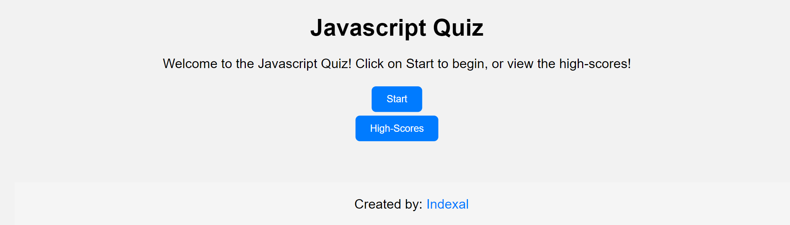
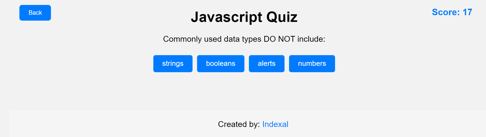
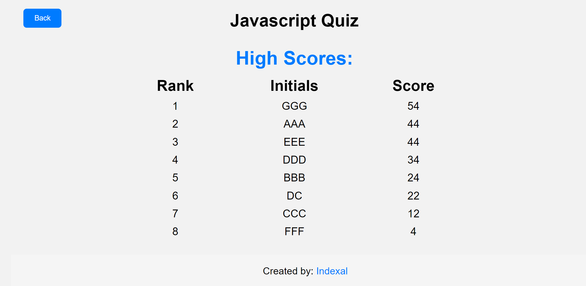

# 🚀 JavaScript Quiz 🚀

Welcome to the **JavaScript Quiz!** 🌟 This is not your average quiz; it's a thrilling web-based experience that tests your JavaScript prowess. Let's dive into the world of coding fun! 💻🚀

## Table of Contents

- [Introduction](#introduction)
- [Features](#features)
- [Usage](#usage)
- [Screenshots](#screenshots)
- [How It Works](#how-it-works)
- [License](#license)

## Introduction

The **JavaScript Quiz** is your ticket to JavaScript mastery! 🎓 It features mind-bending multiple-choice questions, a ticking timer, and a scoring system that keeps you on your toes. Don't forget to submit your initials and check out the high scores!

## Features

- 🤔 Multiple-choice questions on JavaScript
- ⏱️ Timer countdown during the quiz
- 🎯 Scoring system based on correct and incorrect answers
- 📋 Submission of initials and display of high scores
- 📱 Responsive design for various screen sizes

## Usage

1. 🔄 Clone the repository to your local machine.
2. 🌐 Open the `index.html` file in your preferred web browser.
3. 🚀 Click on "Start" to embark on the quiz or "High Scores" to view top scores.
4. 🤓 Answer the questions within the time limit.
5. 🎉 Submit your initials after conquering the quiz.

## Screenshots

## How It Works

The magic happens with HTML for structure, CSS for styling, and JavaScript for interactivity! 🪄 It cleverly uses local storage to store high scores, providing a seamless and engaging quiz experience.

## License

This project is licensed under the [MIT License](LICENSE). 📜✨